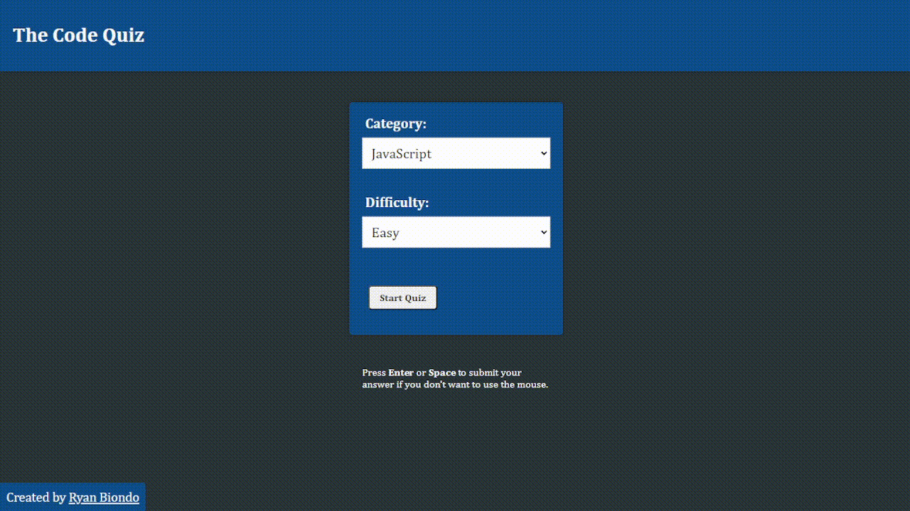

# **The Code Quiz - Client**

## **Overview**

This project is a web client that connects to the Code Quiz server to provide a random list of quiztions from a pool of quizzes. This project is built with React and TypeScript.
You can view the live version of the application [here](https://www.thecodequiz.com).

The server can be found here:
https://github.com/Ryan-Biondo/The-Code-Quiz-Server

## **Demo**



## **Technologies Used**

- React.js
- TypeScript
- CSS
- react-router-dom

## **Features**

- Mulitple categories of quizzes
- Multiple difficulty levels
- Randomized quiz questions
- Randomized answer choices
- Reset button

## **Project Structure**

```
client
├── .eslintrc.cjs
├── .gitignore
├── dist
│   ├── assets
│   │   ├── index-4ef05789.css
│   │   └── index-73cd9ec5.js
│   ├── index.html
│   └── vite.svg
├── index.html
├── LICENSE
├── node_modules
│   ├── ...
├── package-lock.json
├── package.json
├── public
│   └── vite.svg
├── README.md
├── src
│   ├── App.css
│   ├── App.tsx
│   ├── assets
│   │   └── react.svg
│   ├── components
│   │   ├── AnswerList.tsx
│   │   ├── CircleProgressBar.css
│   │   ├── CircleProgressBar.tsx
│   │   ├── ControlButtons.tsx
│   │   ├── Header.tsx
│   │   ├── MainMenu.css
│   │   ├── MainMenu.tsx
│   │   ├── Question.tsx
│   │   └── Timer.tsx
│   ├── contexts
│   │   └── QuizContext.tsx
│   ├── main.tsx
│   ├── pages
│   │   ├── Home.tsx
│   │   ├── Score.tsx
│   │   └── TechQuiz.tsx
│   └── vite-env.d.ts
├── tsconfig.json
├── tsconfig.node.json
└── vite.config.ts
```

## **Development Process**

Process:

- Set up the basic project structure and dependencies using React.js and TypeScript.
- Created the necessary components for the quiz, such as Home, TechQuiz, Score, Header, Timer, Question, AnswerList, ControlButtons, MainMenu, and CircleProgressBar.
- Established the QuizContext to manage the state and provide data to the components.
- Implemented routing using react-router-dom to navigate between different pages.
- Fetched quiz data from the server using the provided API endpoints.
- Implemented logic to display questions, choices, and handle user answers.
- Created the timer to track the time for each question, doesnt work effectively, recreating it.
- Calculated the user's score based on correct answers.
- Added functionality to restart the quiz, go back to the home page, and view the final score.
- Implemented styling and UI to enhance the user experience.
- Tested the application thoroughly to ensure its functionality.
- Split the monolithic structure and deployed the application and the server separately.

Challenges and Solutions:

- Navigating between pages: Initially, there were issues with proper navigation between pages. The useNavigate hook from react-router-dom was utilized to handle page transitions correctly.
- Disabling answer buttons: The challenge was to disable the answer buttons after selecting an answer to prevent multiple selections. By updating the state variables and controlling the button's disabled attribute, the issue was resolved.
- Resetting quiz state: The challenge was to reset the quiz state and clear the selected answer when restarting the quiz or navigating back to the home page. By implementing the resetQuiz function in the QuizContext and resetting the necessary variables, the quiz state was successfully reset even from mid-quiz.
- Fetching quiz data from the server: Initially, there was an issue with fetching the quiz data from the server, resulting in a JSON parsing error. The solution was to ensure that the server responds with valid JSON data and handle any potential errors appropriately.

Overall, the process involved setting up the necessary components, managing state using the QuizContext, implementing routing, fetching quiz data, and handling user interactions.

## **Future Enhancements**

- User database and authorization
- High scores
- Victory images
- More quiz categories
- More questions in the pool
- Improve UI and UX

## **Getting Started**

To run this project locally, you'll need Node.js and npm installed. Here are the steps to get started:

1. Clone this repository: `git clone https://github.com/username/repo.git`
2. Navigate to the project folder: `cd repo`
3. Install dependencies: `npm install`
4. Start the client: `npm run dev`

## **Usage**

The client is deployed at https://www.thecodequiz.com/

## **Contributing**

We welcome contributions to this project. Please fork this repository and create a pull request with your changes.

## **License**

This project is licensed under the MIT License.

## **Acknowledgments**

- Chat-GPT4 for creating most of the questions
- Danny Thompson for inpiring me to create a more professional project
